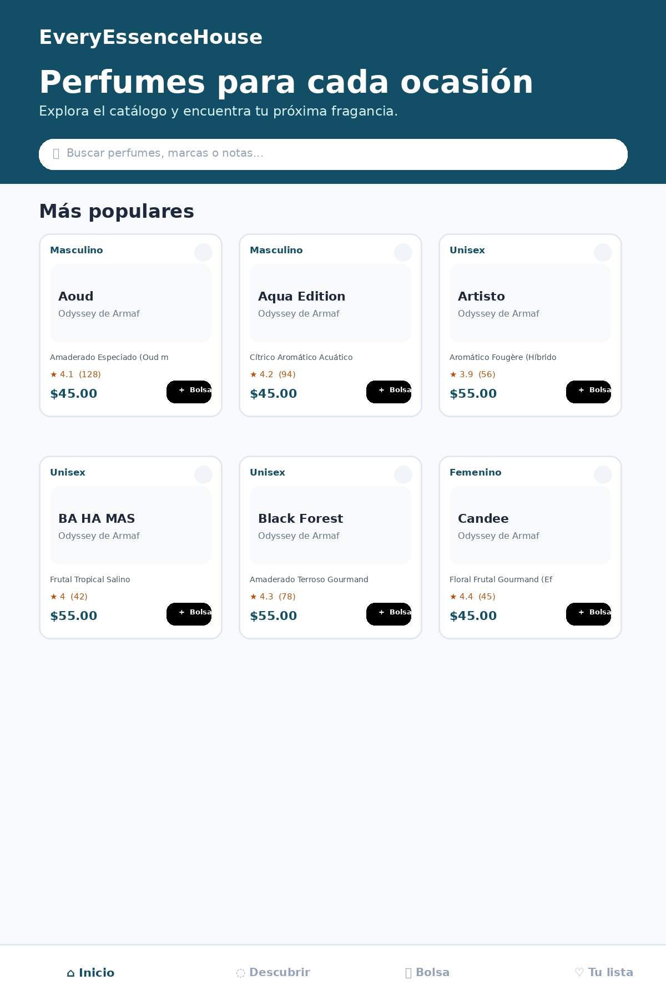
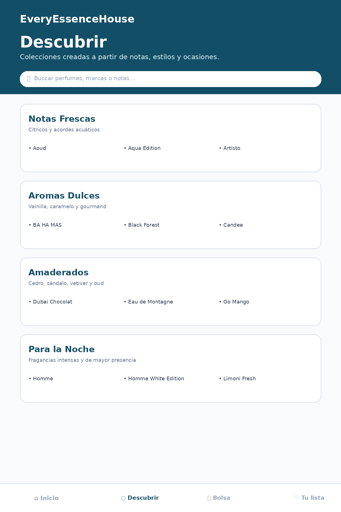
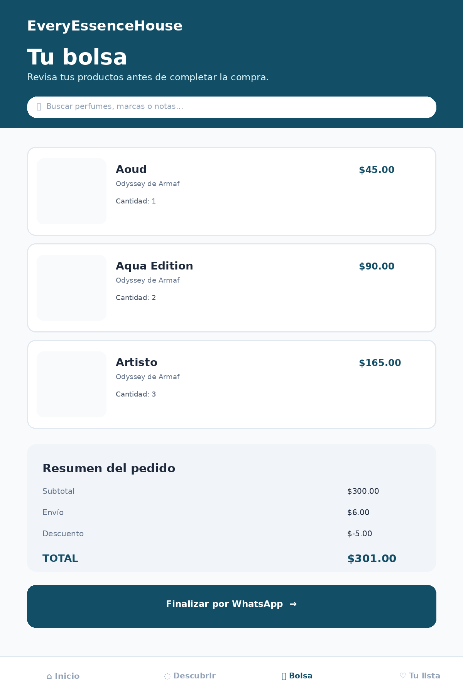

#  EveryEssenceHouse
## 🧴

<p align="center">
  <strong>Catálogo interactivo y tienda web de perfumes</strong><br>
  Experiencia de compra responsive con búsqueda, descubrimiento, favoritos, carrito y checkout mediante WhatsApp.
</p>

<p align="center">
  
  
  
  
  
  
</p>

> Proyecto frontend de **EveryEssenceHouse** reorganizado en una arquitectura separada por responsabilidades: estructura HTML, estilos CSS, lógica JavaScript y catálogo de productos en JSON.

---

## 📸 Previews de la interfaz

### 🏠 Inicio y catálogo



### 🧭 Sección Descubrir



### 🛒 Carrito de compras



> Estas imágenes son previews locales basados en la interfaz actual del proyecto y están pensados para funcionar exactamente como se muestran los ejemplos.

---

## ✨ Características principales

### 🛍️ Catálogo de perfumes

Muestra los productos disponibles mediante un catálogo dinámico. Cada producto mantiene información como nombre, marca, precio, imágenes, valoración, categoría, concentración, género, temporada, perfil aromático, notas, duración y uso recomendado.

### 🔎 Búsqueda y filtros

Incluye una barra de búsqueda interactiva y filtros por categorías para encontrar perfumes según características relevantes del catálogo.

### 🧭 Descubrir

La plataforma incluye una sección de descubrimiento con agrupaciones basadas en notas, estilo, ocasión, temporada y género. Los conjuntos se generan a partir de los datos de cada perfume.

### ❤️ Lista de deseos

Permite marcar perfumes como favoritos, visualizar la cantidad de productos guardados y administrar la lista desde una vista dedicada.

### 🛒 Carrito de compras

Permite añadir productos, modificar cantidades, eliminar artículos y calcular automáticamente subtotal, envío, descuento y total.

### 📲 Checkout por WhatsApp

El carrito genera una solicitud de compra estructurada y la envía a WhatsApp mediante un enlace de checkout, evitando la necesidad de un backend de pagos para esta versión del proyecto.

### 🖼️ Galería de productos

Cada producto dispone de una galería con múltiples imágenes, miniaturas, indicadores, navegación y desplazamiento automático.

### 🔍 Lightbox

Las imágenes pueden abrirse en una vista ampliada independiente con navegación, miniaturas, contador e interacción mediante teclado.

### 📱 Experiencia responsive

La interfaz está pensada especialmente para dispositivos móviles, con navegación inferior, paneles laterales, controles táctiles y soporte de gestos.

---

## 🧩 Arquitectura del proyecto

La versión reorganizada separa las responsabilidades que anteriormente estaban concentradas en un único archivo HTML.

```text
EveryEssenceHouse/
│
├── index.html
│
├── css/
│   └── styles.css
│
├── js/
│   └── app.js
│
├── data/
│   └── products.json
│
├── docs/
│   └── screenshots/
│       ├── home.png
│       ├── discover.png
│       └── cart.png
│
└── README.md
```

### `index.html`

Contiene la estructura y los elementos de la interfaz de la tienda.

### `css/styles.css`

Centraliza los estilos personalizados, animaciones, componentes visuales, paneles, modales, carrito, wishlist y comportamiento responsive.

### `js/app.js`

Contiene la lógica de la aplicación: navegación, búsqueda, filtros, favoritos, carrito, modales, galerías, carruseles, interacción táctil y renderizado dinámico.

### `data/products.json`

Contiene el catálogo de perfumes separado de la lógica de presentación. Esto facilita añadir, editar o retirar productos sin modificar la estructura principal del JavaScript.

### `docs/screenshots/`

Almacena capturas utilizadas por este README para documentar visualmente el proyecto.

---

## 📦 Datos de productos

El catálogo se carga dinámicamente desde:

```text
/data/products.json
```

El navegador obtiene el archivo mediante `fetch()` y, una vez cargado correctamente, inicializa la interfaz con los productos disponibles.

Esto permite mantener una separación clara entre:

```text
Interfaz  → index.html
Estilos   → css/styles.css
Lógica    → js/app.js
Datos     → data/products.json
```

---

## 🧰 Tecnologías utilizadas

| Tecnología | Uso |
|---|---|
| **HTML5** | Estructura semántica de la aplicación |
| **CSS3** | Estilos personalizados, animaciones y responsive design |
| **JavaScript ES6+** | Lógica, estado y renderizado dinámico |
| **Tailwind CSS** | Utilidades de estilo utilizadas directamente desde CDN |
| **JSON** | Almacenamiento separado del catálogo de productos |
| **Animated Icons** | Iconografía animada utilizada en la interfaz |

---

## 🚀 Instalación y ejecución

### 1. Clonar el repositorio

```bash
git clone https://github.com/dar003/EEH-Perfumes-Cat-logo-y-Tienda-Web.git
cd EveryEssenceHouse
```

### 2. Ejecutar con un servidor local

Debido a que el catálogo se carga desde `data/products.json` utilizando `fetch()`, se recomienda ejecutar el proyecto mediante un servidor HTTP local.

Con Python:

```bash
python -m http.server 8000
```

Luego abre:

```text
http://localhost:8000
```

También puede utilizarse cualquier servidor estático equivalente, como Live Server de VS Code.

---

## ⚙️ Configuración del checkout

El checkout utiliza una variable de configuración del proyecto para determinar el número de WhatsApp de destino.

Antes de publicar una versión funcional, revisa la configuración de:

```text
WHATSAPP_PHONE
```

y sustituye el valor de ejemplo por el número correspondiente al negocio.

---

## 📱 Compatibilidad

La interfaz está diseñada para adaptarse principalmente a móviles y también funciona en navegadores modernos de escritorio.

Se recomienda probar especialmente:

- Chrome / Chromium
- Edge
- Firefox
- Safari

---

## 🔮 Próximas mejoras

Algunas evoluciones naturales para el proyecto serían:

- Persistencia de carrito y favoritos mediante `localStorage`.
- Integración con una base de datos o API para gestionar productos.
- Panel administrativo para actualizar el catálogo.
- Sistema de autenticación de usuarios.
- Gestión real de inventario.
- Checkout con pagos online.
- Optimización y alojamiento local de imágenes de productos.

---

## 📄 Licencia

Este repositorio puede adaptarse a la licencia que corresponda al uso final del proyecto y de sus recursos.

---

## 👨‍💻 Autor

**EveryEssenceHouse**

Proyecto de catálogo y tienda web orientado a una experiencia de exploración y compra de perfumes desde dispositivos móviles y escritorio.
